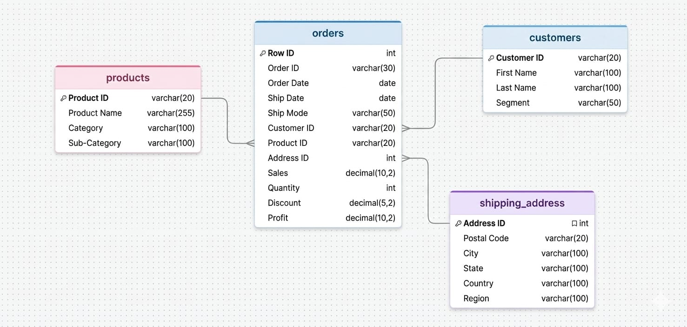
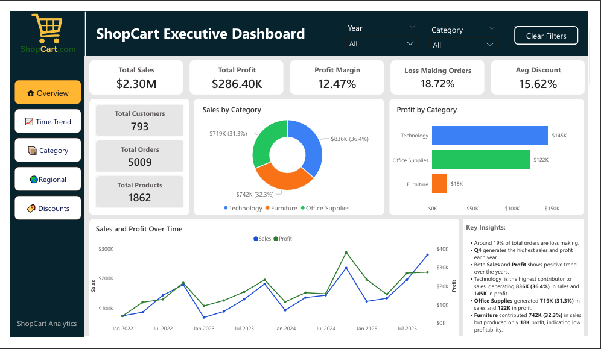
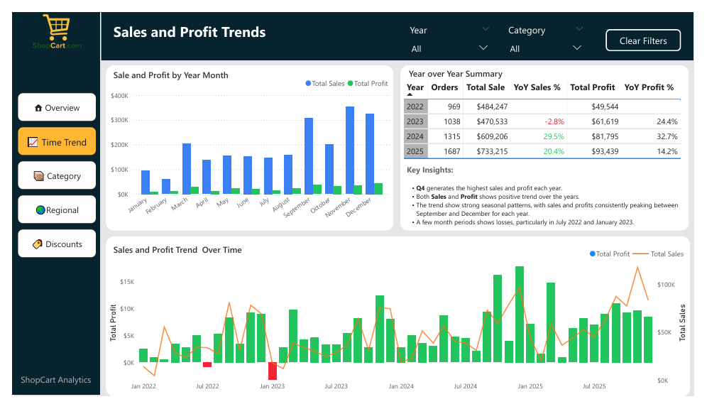
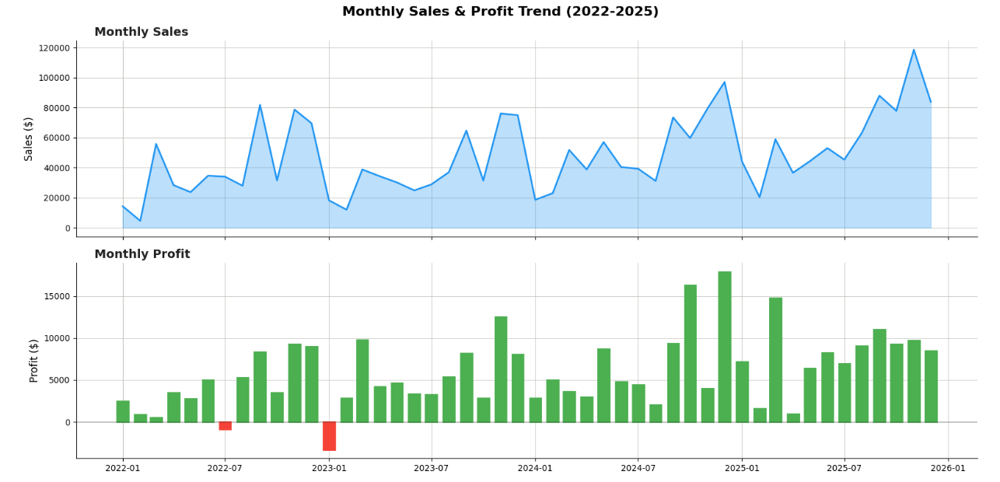
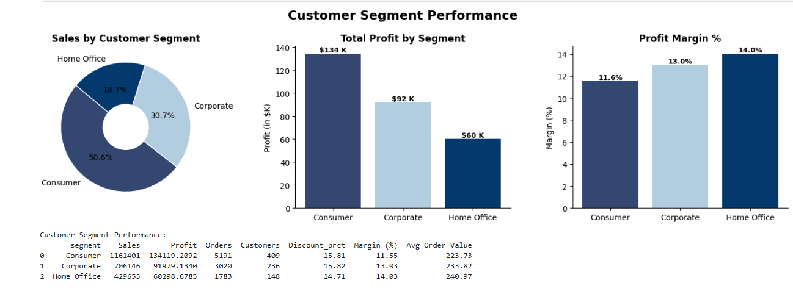
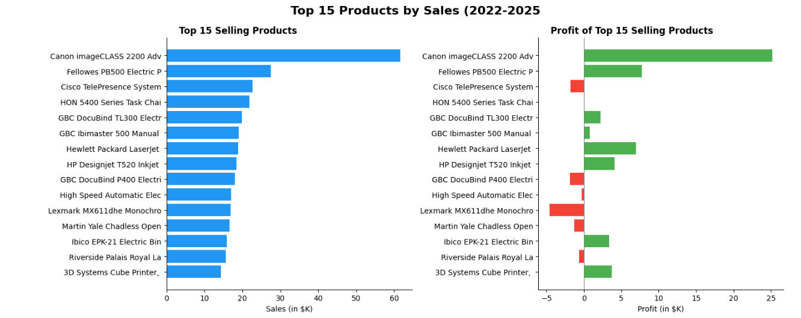

  

# ShopCart Sales and Profit Analysis

## Objective
_The primary objective of this project is to analyze ShopCart’s historical sales data from 2022–2025 to evaluate sales performance and identify the key drivers of profitability across products, regions, categories, and customer segments in the United States._

## Project Background
ShopCart is an e-commerce company that operates in North America. It sells products across different categories such as Furniture, Office Supplies, and Technology. Over the years, the company has experienced steady growth in sales and customer demand.

Despite this growth, the company began facing challenges related to profitability, operational efficiency, and sales performance across different product categories and regions.

To better understand these challenges, the company hired a Data Analyst to analyze historical sales data from 2022 to 2025 and identify the key factors affecting profitability., canyou make it more better 

### Business Questions

1) **Business Summary**: What are the company’s total sales, profit, and other key performance indicators (KPIs)?
2) **Trend Over Time**: How have sales and profits changed over time? Are there any noticeable seasonal patterns or trends?
3) **Profitability Drivers**: Which products categories and sub-categories are the most & least profitable?
4) **Regional Performance**: Which geographical regions and states contribute most to sales and profit? Are there any regions with high sales but low profitability ?
5) **Customer Segment Analysis**: Which customer segment is most valuable ?
6) **Discount Impact**: How do discounts affect profitability? What are the tipping points where discounts begin to negatively impact profit?

### About Data
The dataset for this project is stored in the shopcart_analytics database across four main tables: **orders**, **customers**, **products**, and **shipping_address**.

  
- The orders table contains transactional details such as Order ID, Order Date, Ship Date, Ship Mode,Quantity, Sales, Discount, and Profit.
- The customers table includes information about each customer, including Customer ID, First name, Last Nnmae, and the customer segment.
- The products table contains details about each product, such as Product ID, Product Name, Category, and Sub-Category.
- The shipping_address table contains location details, such as Postal Code, City, State, Country, and Region.
  
These tables are joined to create a single dataset for analyzing sales and profit trends in the United States between January 2022 and December 2025.

### Featured Notebooks/Dashboards
- [Notebook](notebooks/shopcart_analysis.ipynb)
- [Dashboard](dashboards/shopcart_dashboard.pbix)

### Tools Used
- Python (Pandas, NumPy, Matplotlib, Seaborn) for Data Cleaning, Exploratory Data analysis (EDA), and Visualization
- Jupyter Notebook
- MySQL for data querying and structured analysis
- Power BI for interactive dashboards and visual insights

### Dashboard Preview
#### Preview 1: Executive Dashboard and KPIs

#### Preview 2: Time Trend

#### Preview 3: Regional Analysis

### Glimpses of EDA

#### 1) Monthly Sales and Profit Trend (2022-25)

#### 2) Customer Segment Analysis

#### 3) Products Analysis

## Summary and Final Insights

#### ShopCart Executive Summary (2022–2025)

| Metric | Value |
|---|---|
| **Total Revenue** | $2,297,201 |
| **Total Profit** | $286,397 |
| **Overall Profit Margin** | 12.47% |
| **Average Discount Offered** | 16.0% |
| **Loss-Making Orders** | 1,871 (18.72% of total orders) |
| **Total Orders Processed** | 5,009 |
| **Total Customers** | 793 |
| **Average Shipping Time** | 3.96 days |

